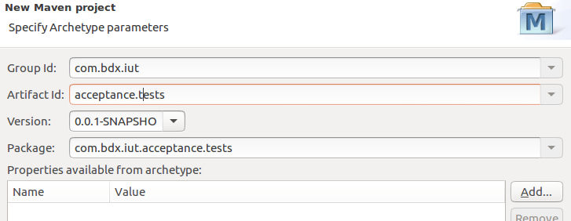

= Créer un projet Maven sous Eclipse

== Un nouveau projet Maven

* Sélectionnez File -> New -> Project....
* Maven puis Maven Project cliquez sur Next et utilisez le workspace par défaut
* Cliquez sur Next pour sélectionner l'archétype que vous souhaitez utiliser.
* Par défaut maven-archetype-quickstart est sélectionné et nous garderons cet archétype pour créer le projet.
* Cliquez sur Next et renseignez ensuite le groupId et l'artifactId.
** Le **groupId** est un identifiant unique pour l’organisation qui créé le projet.
** L'**artifactId** est le nom unique pour l’artefact principal généré par ce projet.

* cliquer sur `Finish` pour créer le projet Maven et le voir s'afficher dans le **Package Explorer** d'Eclipse.

== Mettre à jour le pom.xml

* Le Projet Object Model (POM) est le fichier central de configuration d'un projet Maven. Il contient une description détaillée du projet, où l'on retrouve des informations concernant le versionnage et la gestion des configurations, les dépendances, les ressources de l’application, les tests, ...
* modifier le pom.xml comme ceci:

....
<project xmlns="http://maven.apache.org/POM/4.0.0" xmlns:xsi="http://www.w3.org/2001/XMLSchema-instance"
  xsi:schemaLocation="http://maven.apache.org/POM/4.0.0 http://maven.apache.org/xsd/maven-4.0.0.xsd">
  <modelVersion>4.0.0</modelVersion>

  <groupId>com.bdx.iut</groupId>
  <artifactId>acceptance.tests</artifactId>
  <version>0.0.1-SNAPSHOT</version>
  <packaging>jar</packaging>

  <name>acceptance.tests</name>
  <url>http://maven.apache.org</url>

 <properties>
    <project.build.sourceEncoding>UTF-8</project.build.sourceEncoding>
    <maven.compiler.source>1.8</maven.compiler.source>
    <maven.compiler.target>1.8</maven.compiler.target>
  </properties>

  <dependencies>
    <dependency>
      <groupId>junit</groupId>
      <artifactId>junit</artifactId>
      <version>4.12</version>
      <scope>test</scope>
    </dependency>
  </dependencies>
</project>
....

* Pour que ces modifications soient bien prises en compte sur votre projet, il faut effectuer une mise à jour du `pom.xml` de la manière suivante :
** Effectuez un clic droit sur le nom du projet **acceptance.tests** et vérifier que **Force Update of Snapshots/Releases** est bien coché
** Ensuite Maven -> Update Project... et cliquez OK pour valider.

== Installer le plug-in Cucumber-Eclipse

* Cucumber-Eclipse est un plugin Eclipse qui permet d'écrire et d'exécuter les scénarii Cucumber directement dans l'IDE facilitant ainsi leur automatisation.
* Pour installer ce plug-in dans Eclipse,
** utiliser le menu Help → Install New Software...
** et indiquer l'adresse du site suivante : https://cucumber.io/cucumber-eclipse//update-site

== Configurer le pom.xml pour Cucumber

Mettre à jour votre pom.xml avec les trois dépendances suivantes :

....
<dependencies>
    <dependency>
        <groupId>info.cukes</groupId>
        <artifactId>cucumber-java</artifactId>
        <version>1.2.4</version>
        <scope>test</scope>
    </dependency>

    <dependency>
        <groupId>info.cukes</groupId>
        <artifactId>cucumber-junit</artifactId>
        <version>1.2.4</version>
        <scope>test</scope>
    </dependency>

    <dependency>
        <groupId>junit</groupId>
        <artifactId>junit</artifactId>
        <version>4.12</version>
        <scope>test</scope>
    </dependency>
</dependencies>
....

Une fois, le pom.xml modifié, n'oubliez pas de relancer Maven -> Update Project...

== Décrire le comportement

* Créer un nouveau Source Folder que vous appelerez src/test/features et créer un fichier cocktail.feature

== Ecriture du runner Cucumbers

Création d'un fichier RunCucumberTest.java dans le package src/test/java/com/bdx/iut/acceptance/tests
Implémenter ce fichier de manière à ce qu'il devienne le lanceur des tests Cucumber :

....
package com.bdx.iut.acceptance.tests;

import cucumber.api.CucumberOptions;
import cucumber.api.junit.Cucumber;
import org.junit.runner.RunWith;

@RunWith(Cucumber.class)
@CucumberOptions(features= {"src/test/features/"})
public class RunCucumberTest { }
....

== Exécuter RunCucumberTest

* Exécutez les scénarii en faisant Run As -> JUnit Test sur RunCucumberTest

* Le fichier contenant les steps n'existe pas encore donc quand on lance

== Implémenter le code de test des steps

* Créer un fichier CocktailSteps.java dans le package src/test/java/com/bdx/iut/acceptance/tests
* Implémenter ce fichier de steps en copiant/collant le rapport de tests fourni par la console
* Il devrait ressembler à ça une fois les imports maj :

....
package com.bdx.iut.acceptance.tests;

import cucumber.api.PendingException;
import cucumber.api.java.en.Given;
import cucumber.api.java.en.Then;
import cucumber.api.java.en.When;

public class CocktailSteps {

	@Given("^Romeo who wants to buy a drink$")
	public void romeo_who_wants_to_buy_a_drink() throws Throwable {
	    // Write code here that turns the phrase above into concrete actions
	    throw new PendingException();
	}

	@When("^an order is declared for Juliette$")
	public void an_order_is_declared_for_Juliette() throws Throwable {
	    // Write code here that turns the phrase above into concrete actions
	    throw new PendingException();
	}

	@Then("^there is no cocktail in the order$")
	public void there_is_no_cocktail_in_the_order() throws Throwable {
	    // Write code here that turns the phrase above into concrete actions
	    throw new PendingException();
	}
}
....

== Pending en erreur dans le rapport

* Pour avoir les tests au rouge lorsque une(des) step(s) reste(nt) à implémenter ajouter l'option ",strict = true" après features dans les CucumberOptions

== le code métier de l'application

* Créer un fichier Order.java dans un package src/test/java/com/bdx/iut/acceptance/tests

....
package com.bdx.iut.acceptance.tests;

import java.util.ArrayList;
import java.util.List;

public class Order {

	private String from;
	private String to;

	private List<String> contents = new ArrayList<String>();

	public void declareOwner(String romeo) {
		this.from = romeo ;
	}

	public void declareTarget(String juliette) {
		this.to = juliette ;
	}

	public List<String> getCocktails() {
		return contents;
	}
}
....

== Implémentation des steps en Java

* Implémentez les steps pour avoir un test au vert